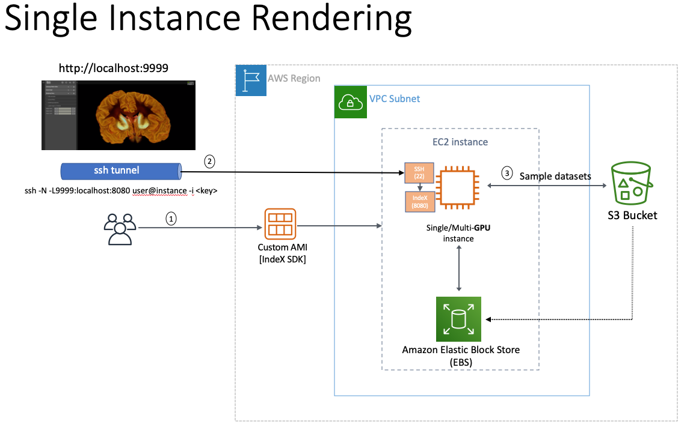
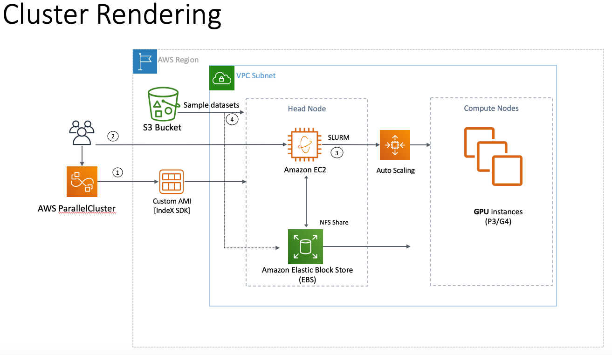

# NVIDA IndeX SDK for 3D Volumetric Visualization on the AWS Cloud

NVIDIA IndeX is a 3D volumetric interactive visualization toolkit that allows scientists and researchers to visualize and interact with terabytes to petabytes of compute data sets. IndeX allows users to make real-time modifications, and navigate to the most pertinent parts of the data, all in real-time, to gather better insights faster. IndeX leverages GPU clusters for scalable, real-time, visualization and computing of multi-valued volumetric data together with embedded geometry data. Primary benefits include:

1. Visualization: Accurate, high-quality data visualization, feature representation, and annotation.
2. Scalability: Optimized for NVIDIA GPUs, such as the NVIDIA V100 Tensor Core GPU (AWS P3 instances), T4 Tensor Core GPU (AWS G4 instances). Transparently scales across multiple GPUs, as well as, across multiple nodes. Node count can be selected upfront and the number of compute servers can be changed dynamically through auto scaling.
3. Extensibility: Flexibility for a variety of application domains.

NVIDIA IndeX can be run on AWS GPU instances using a custom AMI (Amazon Machine Image). The custom AMI is pre-installed with IndeX SDK, required drivers and software dependencies. IndeX has a direct plugin to load the compute data sets from Amazon S3 (Simple Storage Service). This allows users to store massive datasets in Amazon S3 object storage and load them directly from the Amazon EC2 compute instances without having to copy them to the local storage. Sample datasets are available in Amazon S3 buckets from different scientific application domains (Astronomy, HealthCare, Oil & Gas) which can be readily loaded to get a feel of the visualization experience using IndeX on Amazon EC2 instances. Users can also load their own custom data in NVIDIA IndeX using the instructions provided [here](load-custom-data.md)

## Architecture

Users have two options for 3D Volume rendering using IndeX on AWS Cloud i.e. either using a single instance for relatively smaller datasets or using a cluster of instances for larger datasets. Below is the high level architecture for the two options:

Also, users have two main options to deploy IndeX:

1. Using the standalone IndeX SDK & IndeX native web viewer
2. Using IndeX for ParaView plugin - ParaView is one of the most popular visualization tools in the scientific HPC community.

Here we provide step-by-step instructions for the different options :

- [Single instance rendering using IndeX native web viewer](aws-ami-nvindex.md)
- [Single instance rendering using IndeX for ParaView plugin](aws-ami-paraview.md)
- [Cluster Rendering using AWS ParallelCluster and IndeX native web viewer](aws-pcluster-nvindex.md)
- [Cluster Rendering using AWS ParallelCluster and IndeX for ParaView plugin](aws-pcluster-paraview.md)
